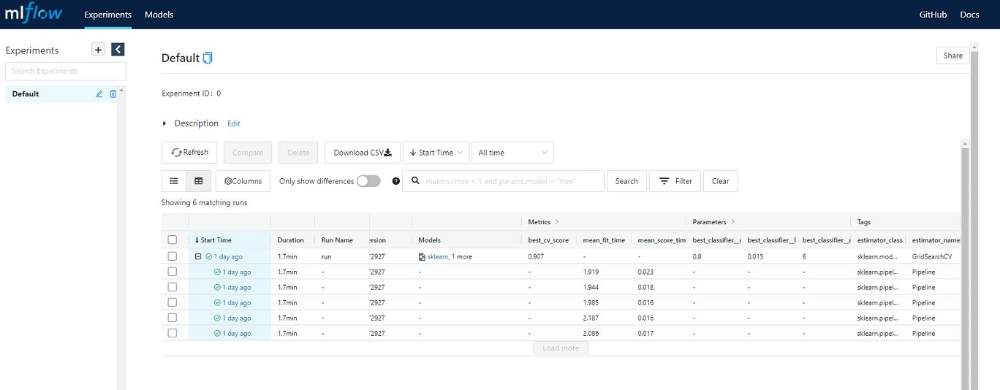
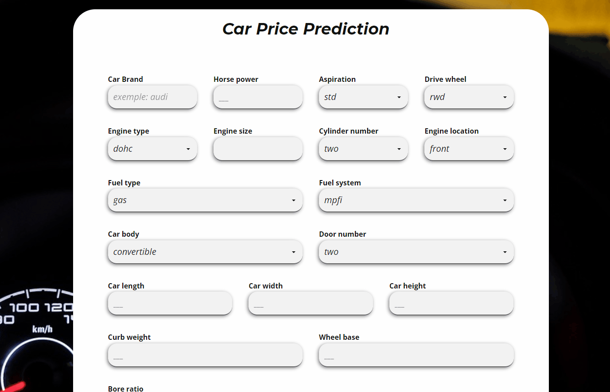

# Deploying Machine Learning as Web App on Google Cloud Run using MLflow, flask and github actions 

## Requirements
* Python 3.8
* Docker
* Google Cloud Plateform account

## Quick Start
* Clone the repository
<pre>
git clone https://github.com/amine-akrout/car-price-prediction
</pre>
* Create a virtual and install requirements
<pre>
python -m venv
pip install -r requirements.txt
</pre>
* Train XGBoostmodel and log metrics and artifacts with MLflow
<pre>
python ./model.py
</pre>

**MLflow experiment**

## Test locally
To test the web app locally using docker, start by building the image from the Dockerfile
<pre>
docker build --pull --rm -f "Dockerfile" -t carprice:latest "."
</pre>

<pre>
PORT=8080 && docker run -p 9090:${PORT} -e PORT=${PORT} carprice
</pre>
the Web app should be runnining on http://localhost:9090/

## Deploy to cloud Run

<pre>
gcloud builds submit --tag gcr.io/$PROJECT_ID/carprice  --project=$PROJECT_ID

gcloud run deploy --image gcr.io/$PROJECT_ID/carprice --platform managed  --project=$PROJECT_ID --allow-unauthenticated
</pre>

## CI/CD workflow
Using Github actions and [cloud-run.yml](https://github.com/amine-akrout/car-price-prediction/blob/main/.github/workflows/cloud_run.yml), we could continuously deploy the web app by simply using the term "deploy" in the commit message when pushing to main branch

## Demo

## References:
* Data can be found here: [kaggle](https://www.kaggle.com/iadelas/car-price-prediction-rf-92/data)
* Federico Tartarini [Continuous deployment to Google Cloud Run using GitHub Actions](https://youtu.be/NCa0RTSUEFQ)
* Michael Harmon [GreenBuildings3: Build & Deploy Models With MLflow & Docker](http://michael-harmon.com/blog/GreenBuildings3.html)
